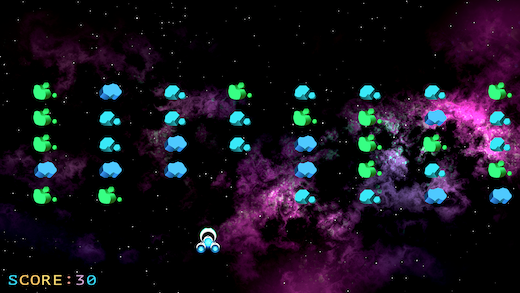

# [Game Porting Toolkit](https://developer.apple.com/games/game-porting-toolkit/)


🔗 Jump to: [Overview](#overview) · [Feedback](#feedback) · [Getting started](#getting-started) · [Skills](#skills) · [Samples](#samples) · [License](#license)

## Overview

The [Game Porting Toolkit](https://developer.apple.com/games/game-porting-toolkit/) helps developers bring existing games and engines to Apple platforms, providing developer tools such as the evaluation environment for Windows games and Metal Shader Converter. To learn more, go to https://developer.apple.com/games/game-porting-toolkit/.

This repository includes: 

- A collection of [agent skills](plugins/game-porting-skills/) to assist porting games to Apple platforms so you can produce higher-quality ports and ship on Apple platforms faster.
  - **Expert skills** that provide domain knowledge to AI agents - covering Metal 4, MetalFX, shader compilation, platform frameworks, and debugging tools.
  - **Workflow skills** that provide a streamlined, milestone-based porting process, pulling in expert skills and persisting state between sessions. 

- [Metal-cpp](https://github.com/apple/metal-cpp), enabling the use of Metal directly from C++.

- [Code samples](samples/) covering end-to-end porting techniques.

## Feedback

We would love to hear your feedback using the [Apple Feedback Assistant](https://feedbackassistant.apple.com). Select feedback for **Developer Tools**, and choose the **Game Porting Toolkit** sub-category. We aren't accepting pull requests on this repository at this time.

## Getting started

### Prerequisites

- A Mac with Apple silicon.
- **[macOS 27](https://www.apple.com/os/macos/)** — provides new Metal debugging tools — `gpucapture` and `gpudebug` — to streamline the debugging process.
- **[Xcode 27](https://developer.apple.com/xcode/)** — enables the latest agent-based workflows, equipped with MCP tools for [Xcode](https://developer.apple.com/documentation/xcode/giving-external-agents-access-to-xcode) and [lldb](https://lldb.llvm.org/use/mcp.html).
- **[Game Porting Toolkit 4](https://developer.apple.com/games/game-porting-toolkit/)** - provides latest versions of the evaluation environment for Windows games and Metal Shader Converter.

### Installation

Clone with submodules so `metal-cpp` is populated:

```
git clone --recurse-submodules https://github.com/apple/game-porting-toolkit.git
```

If you already cloned without it, run:

```
git submodule update --init --recursive
```

### Installing the skills

Installation differs depending on your coding agent of choice.

### Plugin layout

The Codex plugin is in `plugins/game-porting-skills/`. Its manifest loads every
directory in `skills/`, including the workflow and expert skills. The repository
marketplace is `.agents/plugins/marketplace.json`.

`porting-assistant` is a skill, not a plugin agent. This keeps the workflow
available through the supported Codex skill interface. The old `agents/` folder
was removed because Codex does not accept an `agents` manifest field.

Claude Code metadata remains in `.claude-plugin/` and points to the moved
package. Gemini installs the same package directory. Both integrations use the
shared skills; they do not use the removed agent folder.

#### Claude Code

- Register the marketplace:
  ```
  /plugin marketplace add apple/game-porting-toolkit
  ```

- Alternatively, register the marketplace from the local git checkout:
  ```
  /plugin marketplace add /path/to/game-porting-toolkit
  ```

- Install the plugin:
  ```
  /plugin install game-porting-skills@game-porting-toolkit
  ```

#### Codex CLI

- Register the marketplace:
  ```
  codex plugin marketplace add https://github.com/apple/game-porting-toolkit
  ```

- Alternatively, register the marketplace from the local git checkout:
  ```
  codex plugin marketplace add /path/to/game-porting-toolkit
  ```

- Install the plugin:
  ```
  codex plugin add game-porting-skills@game-porting-toolkit
  ```

#### Gemini CLI

Install the extension from a local directory:

```
  gemini extensions install /path/to/game-porting-toolkit/plugins/game-porting-skills
```

### Porting with the workflow skills

The workflow skills run a port as a resumable project, built on two levels: a **goal** spans many sessions ("get the simplest sample rendering"); a **milestone** is one session of bounded work toward it. `porting-methodology` is always loaded and defines the rules; the rest are steps you invoke, directly or through the `porting-assistant` skill.

1. **Discover** (`porting-discover`) — analyze the codebase; write a discovery report. Once per codebase.
2. **Plan a goal** (`porting-plan-goal`) — pick the simplest target; break it into dependency-ordered milestones.
3. **Run each milestone** through four user-gated phases:
   - **Prepare** (`porting-start-milestone`) — study code, load skills. No code yet.
   - **Execute** (`porting-execute`) — write code to the engine's conventions.
   - **Validate** (`porting-validate`) — verify at runtime: GPU capture, validation layers, leak checks, review.
   - **Handoff** (`porting-handoff`) — commit, update memory, write a handoff note.
4. **Repeat** — plan the next goal until the port is done. `porting-status` reports where things stand, any time.

State lives on disk in `.porting/` (discovery report, goal documents, handoff notes, `porting-memory.md`), so a port survives session boundaries and context resets.

For the full list of expert and workflow skills, see [game-porting-skills/README.md](plugins/game-porting-skills/README.md).

## Samples

### Starting a Game Port with Metal

|  |  |
|:--|:--|
| [](samples/StartingAGamePortWithMetal) | **[Starting a Game Port with Metal](samples/StartingAGamePortWithMetal)** — An interactive, chapter-based tutorial that walks you through bringing a game from other platforms to macOS, and then to iOS in a single step. It covers project configuration, app life cycle, input, audio, physics simulation, haptics, shader conversion, Metal rendering, Game Center, and CloudKit cloud saves — culminating in a simple game that runs on both macOS and iOS. |

## License

This project is licensed under the terms of the [LICENSE](LICENSE). See [LICENSE](LICENSE) for details.
