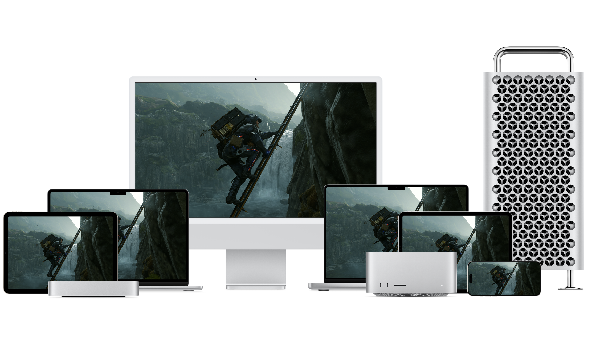

# Bring your games to Mac, iPad, and iPhone

This sample code project is an interactive tutorial consisting of several chapters that show you how to bring your game from other platforms to macOS and then bring it over to iOS in one step. It covers graphics, audio, input, displays, and other key information.

The project includes each source file listed in the *Project navigator* in its configuration, with a final section that brings it all together to implement a simple game that runs both in macOS and iOS. This allows you to experiment by modifying the code, rebuilding, and running it.

## Overview

This project divides the task of bringing your game to Apple devices into a series of small steps, using the following structure:

0. **Configuring your project** - Explains how to configure your game project to target macOS and iOS from a single codebase.
1. **Managing your app’s life cycle** – Shows you how to abstract away differences between macOS and iOS windowing toolkits.
2. **Handling your game’s input** – Demonstrates how to handle input using the Game Controller framework.
3. **Playing audio to further immerse your players** – Provides a reference on different audio middleware available in macOS and iOS, and an introduction to Apple’s powerful audio frameworks.
4. **Implementing physics simulation middleware** – Provides a reference to popular physics middleware available in macOS and iOS, and Apple’s frameworks for accelerated computing.
5. **Implementing tactile feedback through haptics** – Demonstrates how to port game controller rumble code to Apple devices using the Core Haptics framework.
6. **Converting your shaders** – Shows how you can convert your existing shaders to Metal.
7. **Loading your shaders** – Demonstrates how to load your shaders into Metal.
8. **Rendering beautiful graphics with Metal** – Shows you through how to port your renderer to the powerful Metal API and take advantage of EDR.
9. **Make your game even more engaging with Game Center** – Explains how to make your game more social by integrating achievements.
10. **Bringing it all together** – Brings the fundamentals together to demonstrate how to implement a simple game.
11. **Adding cross-device cloud saves to your game using CloudKit** – Uses the CloudKit framework to keep the highest score a player achieves in the game sample in sync across multiple Apple devices.

As you work through these sections, each one contains a `README.md` file indicating how to accomplish the task. Most chapters also contain code you can experiment with, modify, build, and run as you explore its concepts. At the end of each section, the README includes exercises that help you test your knowledge by experimenting with the sample's code and continue exploring the topic.

Use this project as a reference – or even as your starting point – to kickstart your porting effort and target both macOS and iOS devices simultaneously, saving time, and maximizing your player base.

To run this sample, you need Xcode 15 or later, [Metal shader converter](https://developer.apple.com/downloads?q=shader%20converter), and a physical device that supports Metal 3 such as:
* A Mac with Apple silicon running macOS 14 or later.
* An iOS device with the A13 Bionic chip or later running iOS 16 or later.

- Note: This sample code project is associated with WWDC24 session 10089: [Port advanced games to Apple platforms](https://developer.apple.com/videos/play/wwdc2024/10089/).
